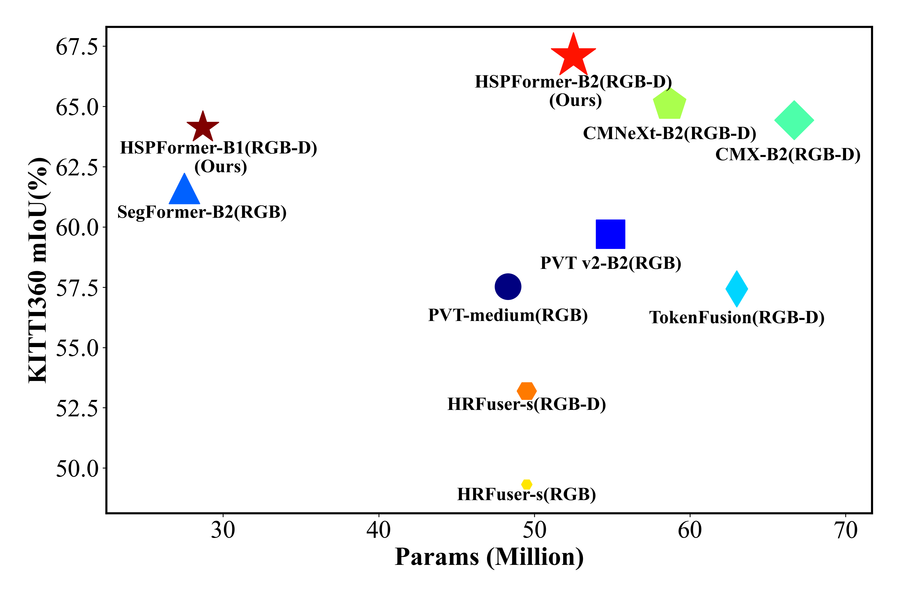

<div align="center"> 

## HSPFormer: Are the attentions in the correct positions? Inferring depth information as learnable position embedding for semantic segmentation

</div>

<div align="center">
  
</div>
<p align="center">
  Figure 1: Performance vs. model efficiency on KITTI-360.
</p>


## Installation
python 3.10
pytorch 1.13.0
cuda 11.7

```text
conda create --name HSPFormer python=3.10
conda activate HSPFormer
conda install pytorch==1.13.0 torchvision==0.14.0 torchaudio==0.13.0 pytorch-cuda=11.7 -c pytorch -c nvidia
pip install -r requirements.txt
```

## dataset

The `data/` folder is structured as:
```text
data/
├── KITTI-360
│   ├── data_2d_raw
│   │   ├── train
│   │   │   ├──2013_05_28_drive_0000_sync
│   │   │   └──....
│   │   └── val
│   ├── data_2d_depth
│   └── data_2d_semantics
├── NYUDepthv2
│   ├── RGB
│   │   ├── train
│   │   └── test
│   ├── HHA
│   ├── Depth
│   └── Label
```

## Model Zoo

coming soon

## Training

Before training, please download [pre-trained PVT v2](https://github.com/whai362/PVT/tree/v2/classification), such as `pretrained/pvt_v2_b2.pth`.

```text
pretrained
├── pvt_v2_b2.pth
└── pvt_v2_b4.pth
```

In addition, you need to go to the torch website to download the resnet weights([Resnet-18](https://download.pytorch.org/models/resnet18-f37072fd.pth), [Resnet-34](https://download.pytorch.org/models/resnet34-b627a593.pth)) and move to the specified directory:

```text
models
├── cnn
├── resnet18-f37072fd.pth
└── resnet34-b627a593.pth
```

The default number of Gpus during training is 2, to change the number of Gpus, please change the node parameter in the configuration file in the configs folder. The training code is as follows:  

```bash
bash ./tools/train_kitti360.sh 
or
bash ./tools/train_nyu.sh 
```


## Evaluation
For evaluation, the weights need to be in a specified directory. For example, training the KITTI360 dataset multiple times will generate KITTI360 under checkpoints/HSPFormer_PosEmbedd/hsp_v2_b2/. KITTI360_1 (the default checkpoints/HSPFormer_PosEmbedd/hsp_v2_b2/KITTI360* directory has weights), you need to change the name in the cfg file to correspond to them. Changing name to KITTI360_1, for example, will automatically load the checkpoints/HSPFormer_PosEmbedd/hsp_v2_b2/KITTI360_1 folder. The instructions to perform the validation are:

```bash
bash ./tools/validate_kitti360.sh 
or
bash ./tools/validate_nyu.sh 
```

### visualization

The visualization phase is similar to the validation phase in that the cfg needs to be modified to achieve the purpose of specifying the weights. The command for reasoning is as follows:

```bash
bash ./tools/pred_kitti360.sh 
or
bash ./tools/pred_nyu.sh 
```

<!-- ## Acknowledgements
Thanks for the public repositories:
- [Pytorch Lightning](https://lightning.ai/docs/pytorch/stable)
- [DELIVER](https://github.com/jamycheung/DELIVER) -->

## License

This repository is under the Apache-2.0 license. For commercial use, please contact with the authors.
